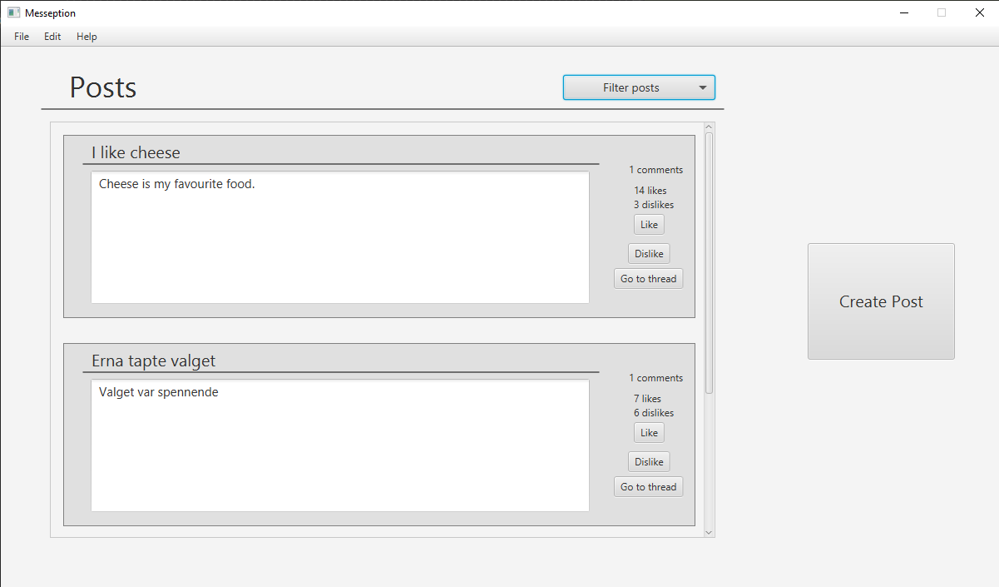
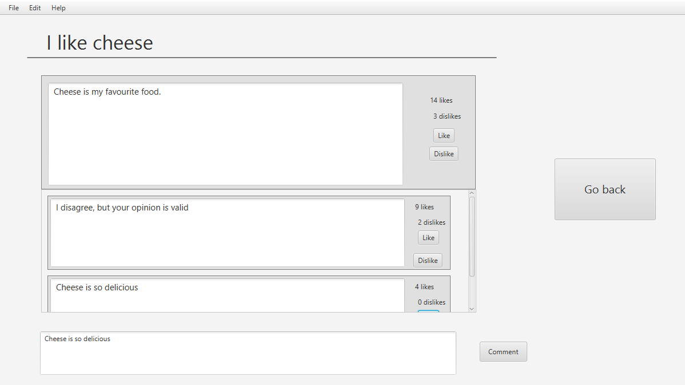
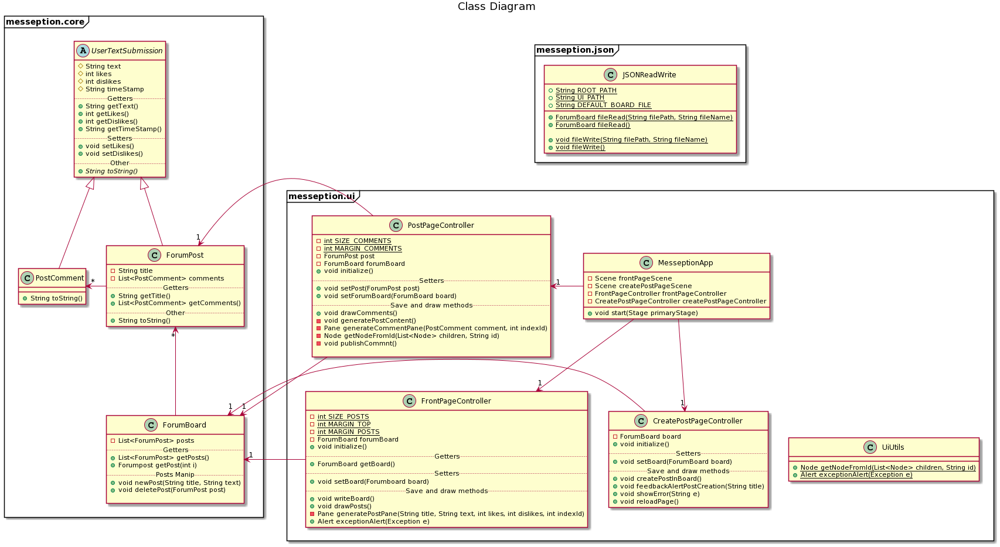

# Messeption: release 2

## Release 2 gives Messeption these basic features:

#### The concept of comments, likes and dislikes have been implemented

- A user can like and dislike posts from the Front Page
    - the like/dislike labels and buttons now work. (They were placeholders in release 1)
- A user can view amount of comments on the Front Page and go to a new page to view them
    - the "Go to Thread" button now changes scene to a new page: Post Page
- Post Page has been added to accomodate for comments
    - All comments that belong to the specified post can be viewed.
        - the comments can be liked and disliked 
    - New comments can be added to the specified post with a simple text area and button
- Likes, dislikes and comments belonging to a post are saved to the local JSON file in similar fashion to the other fields
    

## Screenshots of the app in release 2

    

    

    

# User stories
These user stories have been added in release 2

## Read posts (User story 2)
As a passive user, or someone who does not post a lot, a private person wishes to interact with other people's posts as a way of using the application by agreeing og disagreeing with someone.

### Important details for reading
- Ability to view likes/dislikes on posts

### Important details for interaction
- Ability to Like/dislike posts

## Comment on posts (User story 3)
As an interactive user, a private person wishes to interact with other people's posts by sharing their opinion on that spesific topic.

### Important details for reading
- Ability to view other comments on posts
- Ability to view likes/dislikes on comments

### Important details for interaction
- Ability to comment on posts
- Ability to like/dislike comments

# PlantUML Class Diagram

This is the class diagram for release 2. PlantUML-file can be found at root-level in messeption.

    

