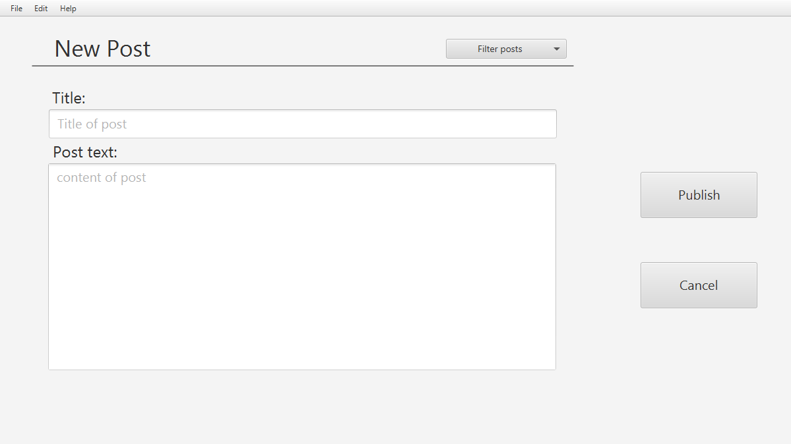

# Messeption: release 2

## Release 2 gives Messeption these basic features:

- A user can like and dislike posts

## Screenshots of the app so far

    

    

# User stories

## Read posts (User story 2)
As a passive user, or someone who does not post a lot, a private person wishes to interact with other people's posts as a way of using the application by agreeing og disagreeing with someone.

### Important details for interaction
- Ability to Like/dislike posts

# PlantUML Class Diagram

This is the class diagram for release 2. PlantUML-file can be found at root-level in messeption.

    

