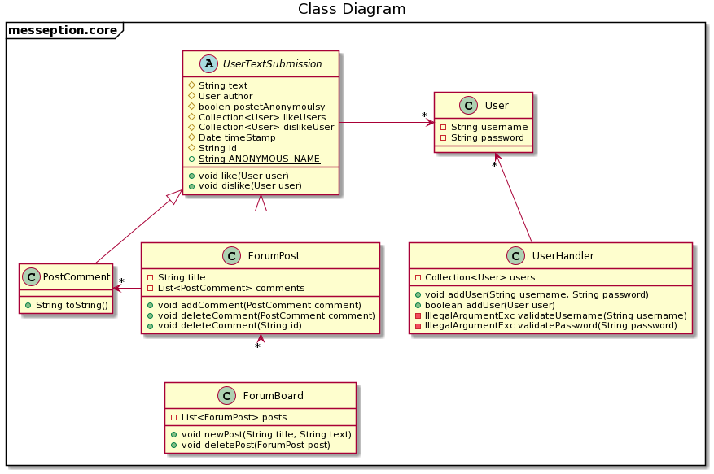
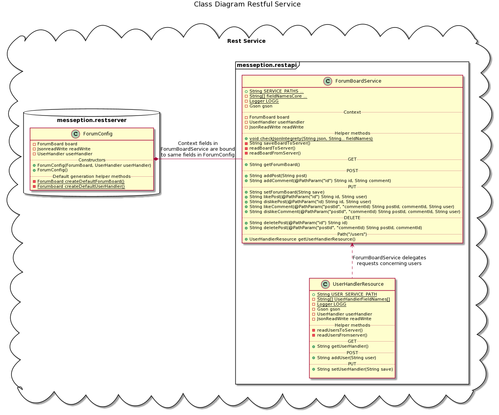
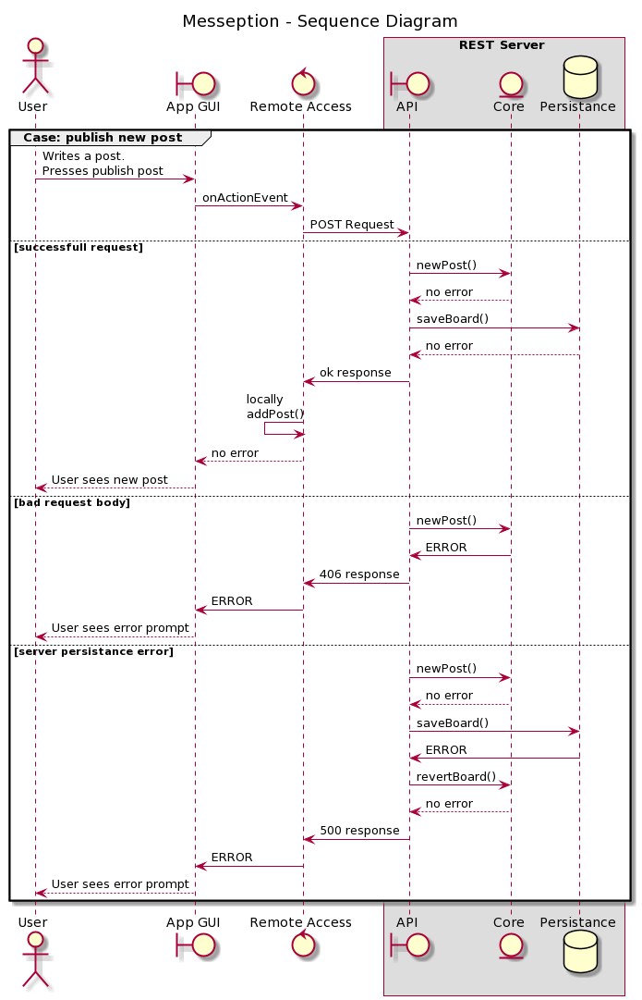
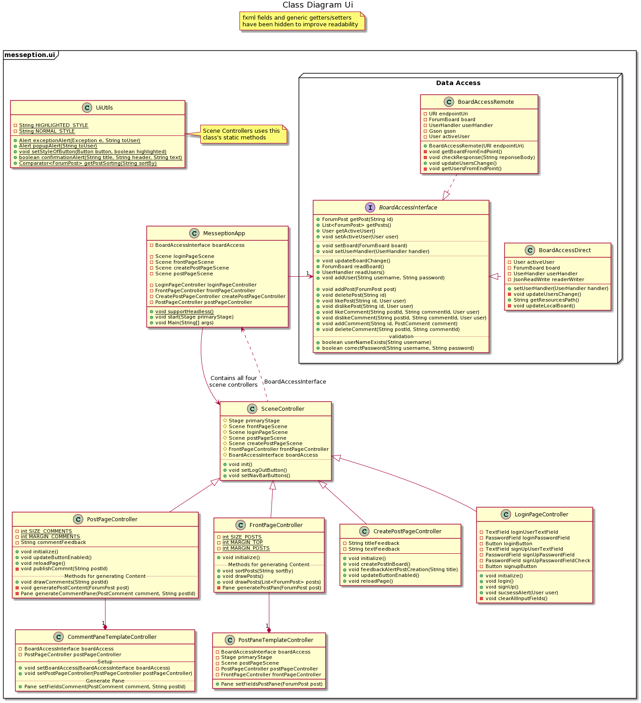
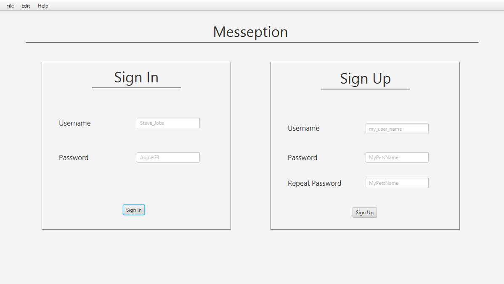
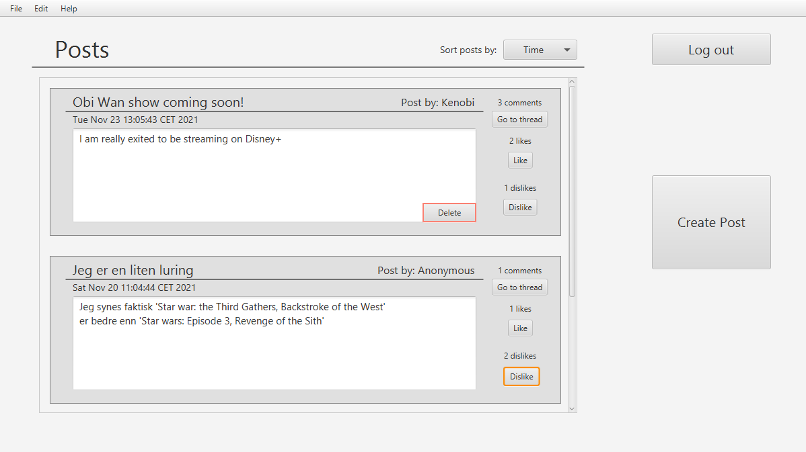
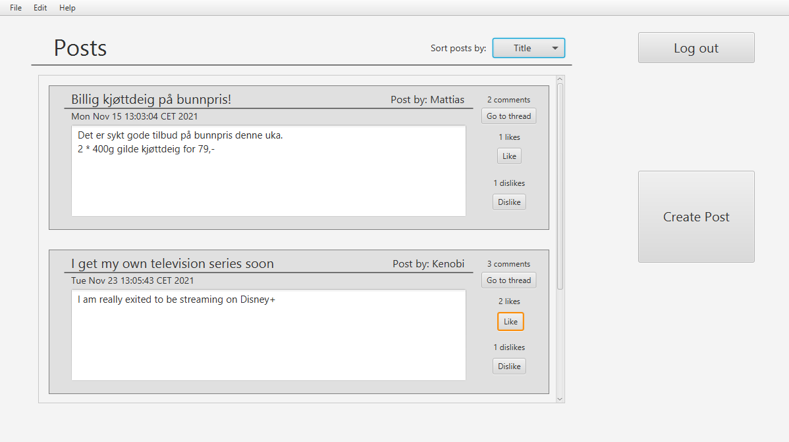
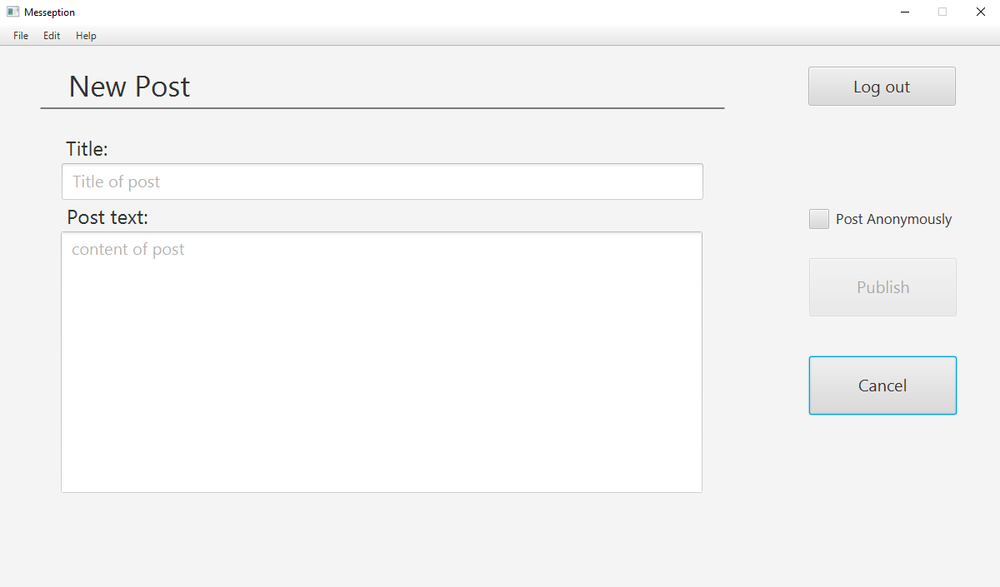
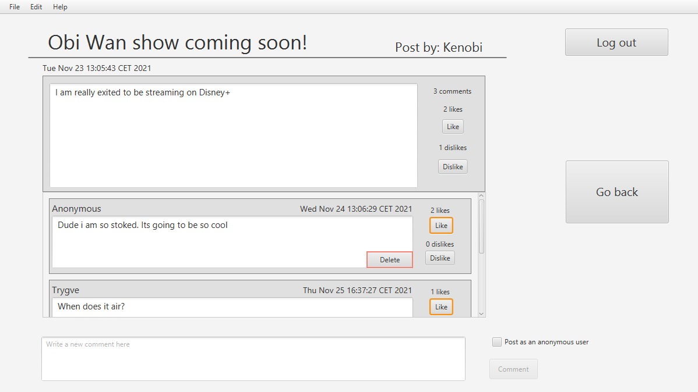

# Messeption: release 3
We have decided to expand the current application with new features, instead of creating a new frontend client for the application
## Release 3 gives Messeption these new features:
- Ability to create an account
    - A user can now create an account, and log in to the application with this account
- Ability to post and comment anonymously
    - A user can now post and comment anonymously by checking a checkbox
- Ability to delete own posts and comments
    - A user can now delete posts and comments connected to their account by pressing a delete button related to a given post or comment
- Ability to sort posts
    - A user can now sort posts by spesific criteria, such as:
        - Descending post date
        - Author
        - Title
        - Descending text length
        - Descending number of comments
- Likes has been changed to a collection of Users
    - A user can only like/dislike a post once
    - A user can not like and dislike a post simultaniously
    - A user can also remove a like or a dislike

The user functionality has been implemented by a new Data class User.java and a class for validation and holding all users, UserHandler.java.
The rest of the code has been updated accordingly to accomodate the User class. For instance, like on a UserTextSubmission has been changes from 'int likes' to 'Collection\<User\> likeUsers'

UserTextSubmission now has a field for Author.

Here you can see how User has affected the core module:

    

## Integrationtests
- This module is for testing the combined project with all the modules running simultaneously as a composite. This takes the form of an app test that is running connected to the REST server. This module also contains the necessary files for running the server locally. This can be done with the command **mvn -pl integrationtests jetty:run**. The integration tests automatically start a server for testing during **mvn verify**
- Additionally a port can be specified when running the server by adding **-Djetty.port=zzzz** where zzzz is the desired port. The project runs with port 8080 by default

## Rest service

    

- The REST-service acts as a server and api for messeption while the app is running remotely. Instead of accessing the data layer directly it sends calls through the REST api. The api accepts http post, put, get and delete requests on specific urls. This would typically be "http://localhost:8080/board" for a request to get the current ForumBoard state with a locals server with default settings. For creating a new ForumPost a http post-request would be sent to ../board/posts/addPost. The objects sent with the http request are json serialized utf-8 encoded strings. These are then decoded back into java objects, with Gson, after being passed through the api

- Current acceptable adresses for board
  - get: ../board
  - put: ../board/set

- Current acceptable adresses for ForumPosts. (Where {id} represents the unique id of a ForumPost)
  - post: ../board/posts
  - put: ../board/posts/likePost/{id}, ../board/posts/dislikePost/{id}
  - delete: ../board/posts/deletePost/{id}

- Current acceptable adresses for comments
  - post: ../board/comments/addComment/{postId}
  - put: ../board/comments/likeComment/{postId}/{commentId}, ../board/comments/dislikeComment/{postId}/{commentId},
  - delete: ../board/comments/deleteComment/{postId}/{commentId}

- Current acceptable adresses for users
  - get: ..board/users
  - post: ..board/users/addUser

- The server responds with http responses throught the api. We also send custom response codes based on http status codes as messages in the responses. This is to gain additional information in case of errors in the server or in case of invalid user input in text fields. This allows us to process these accordingly

This is an example of how our app uses the REST Service:

    

## Shippable product
- The project is configured with jlink and jpackage in order to create a shippable product. In order to ship the project the command **mvn compile javafx:jlink jpackage:jpackage** is used in the messeption/ui directory. In gitpod drop jpackage as wix is not installed.
- This will produce messeptionfx in messeption/ui/target that can be used for running the app locally without the use of an IDE such as VScode.
The command will also produce a MesseptionFX.exe file in messeption/ui/target/dist for distribution and installing messeption as a program localy on a computer. 
- Shipped products require a connection to a REST server running locally on port 8080 in order to work.

 

## New access classes
- In this release we added an access interface to the ui module for communicating with the core module. 
- This interface has been implemenbted by a direct and a remote access class. The direct access class communicates directly with the core module locally, while the remote access class sends calls through the REST api to the server.

The BoardAccess is set in MesseptionApp. Its set to local if the user has set the system property run.local=true, otherwise its set to BoardAccessRemote.
The SceneControllers get this BoardAccess from MesseptionApp.

This is illustrated in the classDiagram of ui:

    

 

## Screenshots of the finished application

 

    

 

    

**Here are the posts sorted by Title instead of Time:**

    

 

    

 

    

 

# User stories

## Create user (User story 4)
An individual wishes to be able to create an account to keep track of their posts, comments and likes

### Important details for reading
- Ability to see own posts, comments and likes
    - Indicated by "author" label 
    - For anonymous posts and comments -> (more info in user story 6 (*) )

### Important details for interaction
- Ability to create posts connected to the logged-in account
- Ability to create comments connected to the logged-in account
- Ability to change likes and dislikes on posts and comments for the logged-in account

 

## Anonymous posts and comments (User story 5)
An individual wishes to be able to express their opinion on a topic without showing their name or information

### Important details for reading
- Ability for a user to see which posts and comments they have posted anonymously and not anonymously 
    - (more info in user story 6 (*) )

### Important details for interaction
- Ability to create posts anonymously
- Ability to comment on posts anonymously

 

## Delete posts and comments (User story 6)
An individual wishes to be able to delete posts and comments they have created because they changed their mind

### Important details for reading
- Deleted posts and comments are removed for all users
- **(*) The delete button works as an indicator to which posts and comments are owned by the logged-in user** in addition to the author-label

### Important details for interaction
- Ability to delete own posts
- Ability to delete own comments

 

## Sort posts (User story 7)
An individual wishes to be able to sort posts based on different criteria

### Important details for reading
- Ability to read posts in a sorted order

### Important details for interaction
- Ability to choose by which criteria to sort the posts
