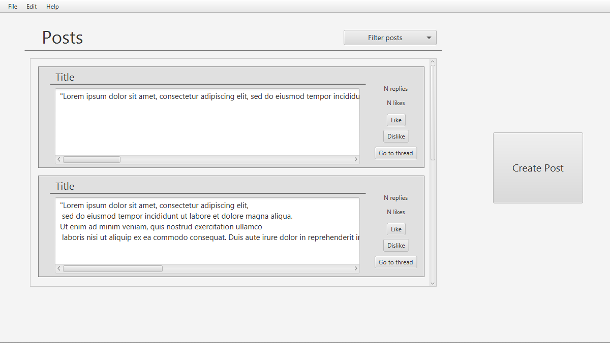
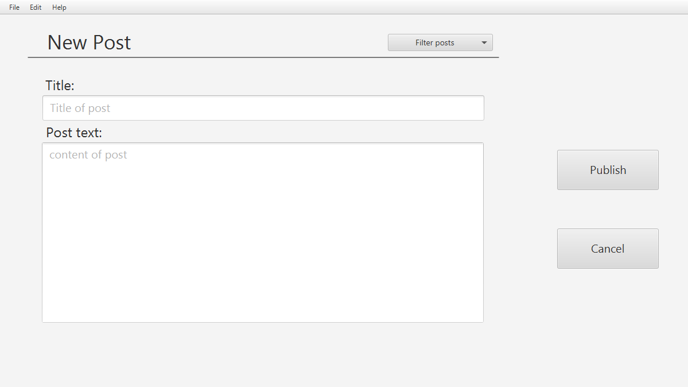
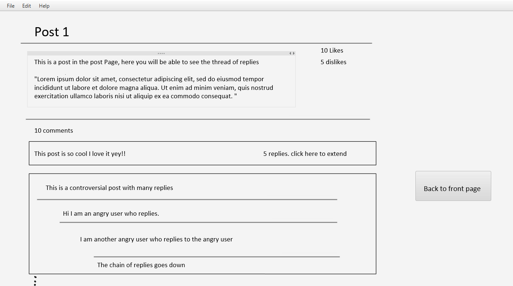

# Description of the app /project

## Messeption
Messeption is an app that takes inspiration from messaging apps and forums. 
These are our inspirational sources: Reddit, Jodel, Twitter.

The purpose of the app is to allow users to communicate with other people via text. The most basic functionality is to post text-posts like you would on a forum. 
Later in the development process we would like to implement the ability to comment on the post and start 'threads'. These 'threads' will be a chain of replies to the original post or to other replies.
Additionally we would like to give users the ability to like/dislike posts.

## images

These images are early prototypes and drawings of how we want the app to look.

#### Front Page

Here you will be able to see a lot of posts.

We want to create a possibility to filter the post.
For instance:
- new posts first
- old posts first
- filter by user
- filter by category

    

#### Create Post Page

Here you can create a new post

    

#### Post Page

Here you will be able to look at a post in more detail, and review its comments.

You will be able to like/dislike and add comments or replies to other comments.

    

# User stories

## write posts (User story 1)
A private person wishes to be able to express his opinion on a certain topic anonymously, and to have that opinion saved.
Aditionally he wishes to have his opinions organized in an easy and readable manner.

### Important details for reading
- Ability to be able to view posts
- Save date and time for when posts are made

### Important details for writing
- Ability to create a post
