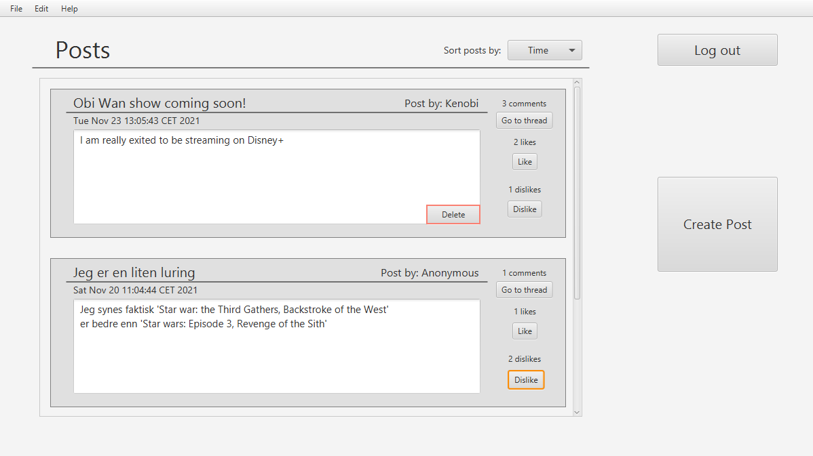

# Description of the messeption app 

## Messeption
Messeption is an app that takes inspiration from messaging apps and forums. 
These are our inspirational sources: Reddit, Jodel, Twitter

The purpose of the app is to allow users to communicate with other people via text. The most basic functionality is to post text-posts like you would on a forum. 
The posts can be commented and liked/disliked.
Comments can also recieve likes and dislikes.
Posts can be sorted by different criteria

The platform allows for account creation, so posts, comments and likes/dislikes are connected to a given account. A given account can delete it's own posts and comments

We have only focused on the connection between Users and posts/comments/likes, and not on security. Hence we have no hashing or encryption for password

 

## Images

These images are from the finished app:

#### Login Page

Here the user can sign up to Messeption by creating a new account or log in to an existing account

    

#### Front Page

Here you will be able to see a lot of posts.
You can navigate to the Create Post Page by pressing the "Create Post" button on the right.
Posts can be liked/disliked from the Front Page.
You can go view a specific post by pressing "Go to thread", this takes the user to the Post Page

The user can sort posts by different properties by pressing the dropdown menu:
Posts can be sorted by:
- Time
- Title
- Author
- Textlength
- Comments

    

#### Create Post Page

Here you can create a new post that will be added to the Front Page

The user can choose to post anonymously, then the author of the post will not be shown

    

#### Post Page

Here you can look at a post in more detail, and review its comments

- You can create a comment to the post
- You can like/dislike the post and/or its comments

Posts and comments can only be liked or disliked once and not both. This means that if a user has liked a posts and presses 'like' the user will then unlike the post

    

 

# Saving userdata
## Autosaving (saving-metaphor)

We automaticly save the state of the app whenever the user changes some of the data. For instance: creating or liking a post. This is because the user does not need to manually decide when the state should be saved. The saved state should always be up to date with current state. While running the app connected to a server the server handles the saving of data

 

## File format

### Gson
We use gson to serialize and deserialize java objects to/from JSON

JSON files are used to store all the fields of a given ForumBoard

This is a brief description of a typical ForumBoard JSON-file (Board.JSON):

- The file consist of a Map with one element. (since the only field in ForumBoard is a List of ForumPosts)

- The key is: "posts" and the value is a list that represent the ForumPost objects.

- Each element in the list is a map with 7 key value pairs
    - "title" and a string
    - "comments" and a List of PostComments
    - "text" and a string
    - "author" and a User
    - "likesUsers" and a Collection of Users
    - "dislikeUsers" and a Collection of Users
    - "timeStamp" and a Date
 

- Each element in the "comments" list is a map with 5 key value pairs
    - "text" and a string
    - "author" and a User
    - "likesUsers" and a Collection of Users
    - "dislikeUsers" and a Collection of Users
    - "timeStamp" and a Date

- A user is represented by two string:
    - "username"
    - "password"

 

# REST server

- The REST-service acts as a server and api for messeption while the app is running remotely. Instead of accessing the data layer directly it sends calls through the REST api. The api accepts http post, put, get and delete requests on specific urls. This would typically be "http://localhost:8080/board" for a request to get the current ForumBoard state with a local server with default settings. For creating a new ForumPost a http post-request would be sent to ../board/posts/addPost. The objects sent with the http request are json serialized utf-8 encoded strings. These are then decoded back into java objects, with Gson, after being passed through the api

- Current acceptable adresses for board
  - get: ../board
  - put: ../board/set

- Current acceptable adresses for ForumPosts. (Where {id} represents the unique id of a ForumPost)
  - get: ../board/posts/{id}
  - post: ../board/posts
  - put: ../board/posts/likePost/{id}, ../board/posts/dislikePost/{id}
  - delete: ../board/posts/deletePost/{id}

- Current acceptable adresses for comments
  - post: ../board/comments/addComment/{postId}
  - put: ../board/comments/likeComment/{postId}/{commentId}, ../board/comments/dislikeComment/{postId}/{commentId},
  - delete: ../board/comments/deleteComment/{postId}/{commentId}

- Current acceptable adresses for users
  - get: ..board/users
  - post: ..board/users/addUser

- The server responds with http responses throught the api. We also send custon response codes based on http status codes as messages in the responses. This is to gain additional information in case of errors in the server or in case of invalid user input in text fields. This allows us to process theese accordingly

 

# User stories

## Write posts (User story 1)
An individual wants to express his opinion on a certain topic anonymously, and to have that opinion saved.
Aditionally he wishes to have his opinions organized in an easy and readable manner

### Important details for reading
- Ability to view posts

### Important details for writing
- Ability to create a post
- Save date and time for when posts are made

 

## Read posts (User story 2)
A passive user, or someone who does not post a lot, wishes to interact with other people's posts as a way of using the application by agreeing or disagreeing with someone

### Important details for reading
- Ability to view likes/dislikes on posts

### Important details for interaction
- Ability to Like/dislike posts

 

## Comment on posts (User story 3)
An interactive user wishes to interact with other people's posts by sharing their opinion on that specific topic

### Important details for reading
- Ability to view other comments on posts
- Ability to view likes/dislikes on comments

### Important details for interaction
- Ability to comment on posts
- Ability to like/dislike comments

 

## Create user (User story 4)
An individual wishes to be able to create an account to keep track of their posts, comments and likes

### Important details for reading
- Ability to see own posts, comments and likes
    - Indicated by "author" label 
    - For anonymous posts and comments -> (more info in user story 6 (*) )

### Important details for interaction
- Ability to create posts connected to the logged-in account
- Ability to create comments connected to the logged-in account
- Ability to change likes and dislikes on posts and comments for the logged-in account

 

## Anonymous posts and comments (User story 5)
An individual wishes to be able to express their opinion on a topic without showing their name or information

### Important details for reading
- Ability for a user to see which posts and comments they have posted anonymously and not anonymously 
    - (more info in user story 6 (*) )

### Important details for interaction
- Ability to create posts anonymously
- Ability to comment on posts anonymously

 

## Delete posts and comments (User story 6)
An individual wishes to be able to delete posts and comments they have created because they changed their mind

### Important details for reading
- Deleted posts and comments are removed for all users
- **(*) The delete button works as an indicator to which posts and comments are owned by the logged-in account**

### Important details for interaction
- Ability to delete own posts
- Ability to delete own comments

 

## Sort posts (User story 7)
An individual wishes to be able to sort posts based on different criteria

### Important details for reading
- Ability to read posts in a sorted order

### Important details for interaction
- Ability to choose by which criteria to sort the posts
